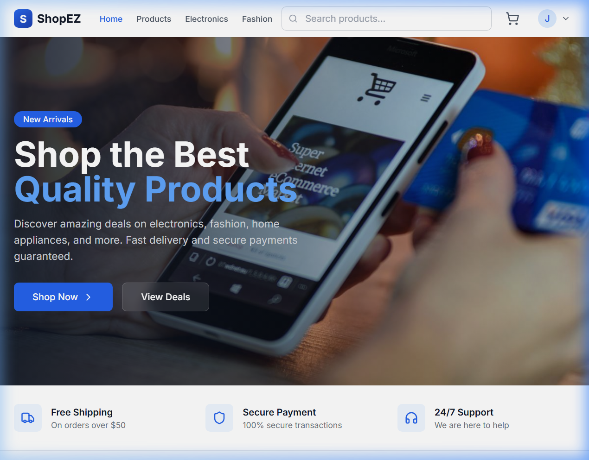
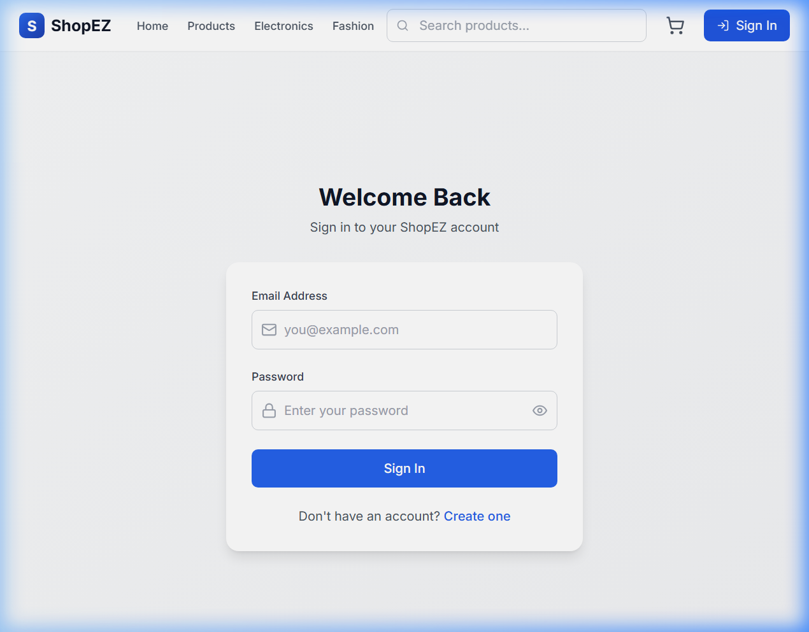
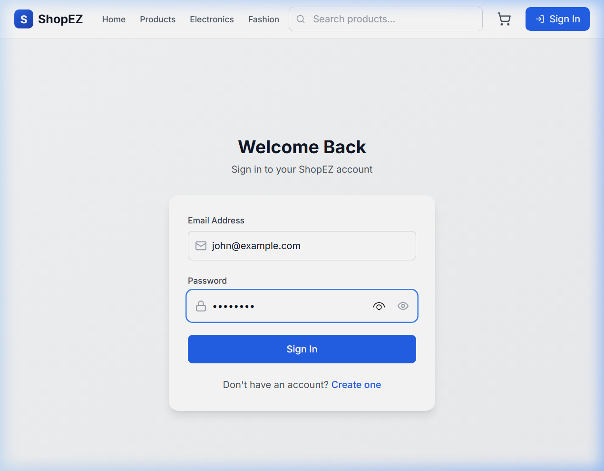

# ShopEZ — Premium localized E-Commerce Platform 🇮🇳

ShopEZ is a modern, full-stack e-commerce application designed and structured with a clean separation of concerns using the **Model-View-Controller (MVC)** architectural pattern. The project is fully localized for Indian users and administrators, featuring a responsive React single-page frontend and a robust Node.js/Express API backed by MongoDB.

## 📸 Screenshots

### 🏠 Homepage (Hero Section)

### 📝 Sign-Up & Register Page (with Custom Rupee Logo)



### 📝 Sign-Up & Register Page (with Custom Rupee Logo)


---

## 🛠️ Technology Stack

### Frontend (Client)
- **Framework & Build Tool**: React 18 (TypeScript) built with Vite (fast Hot Module Replacement).
- **Styling**: TailwindCSS for sleek utility-first responsive styling and layout.
- **Icons**: Lucide React for consistent modern UI icons.
- **Routing**: React Router DOM (v7) managing app-wide client-side routing.
- **Notifications**: React Hot Toast for modern, non-blocking visual feedback.

### Backend (Server)
- **Runtime & Framework**: Node.js with Express.js managing RESTful API routes.
- **Database ORM**: Mongoose connecting to MongoDB.
- **Authentication**: JWT (JSON Web Tokens) for secure, stateless sessions.
- **Security**: bcryptjs for hashing user passwords before database storage.
- **Middleware**: `body-parser` (explicit request body parsing), CORS (Cross-Origin Resource Sharing), Cookie Parser, and Dotenv for environment configuration.

---

## 🎨 Creative Branding & Premium Design

1. **Integrated Brand Logo (`client/src/components/common/Logo.tsx`)**:
   - Features a custom vector design representing a shopping bag outline merged with a stylized Indian Rupee (`₹`) symbol.
   - Accented with a modern Indian tricolor gradient (saffron-white-emerald) on the bag handle and dynamic gold-to-emerald gradient lettering on the logo brand name text.
   - Implemented across the navigation header, footer, login page, and sign-up screens for brand uniformity.

---

## 🇮🇳 Indian Localization Features

The application is fully customized for Indian shoppers and store administrators:
1. **Indian Rupee (₹) Currency**: Price indicators throughout the client (Product Cards, Details, Cart, Checkout, Order Receipt, and Admin logs) display prices in Indian Rupees (`₹`).
2. **Indian Shipping Limits**:
   - Free shipping is offered on order values of **₹500** or higher.
   - For orders below ₹500, a flat shipping fee of **₹50** is automatically applied.
3. **Address & Pincode Validations**:
   - Shipping addresses enforce standard 10-digit Indian mobile number formats.
   - Pincodes undergo a strict 6-digit validation check.
4. **Number Formatting**:
   - Revenue figures on the Admin Dashboard are formatted in accordance with the Indian numbering system (e.g. using `en-IN` to group numbers like `₹1,50,000` rather than `₹150,000`).

---

## 📁 Directory & File Structure

Here is a visual representation of the project structure:

```text
ShopEz-main/
├── Shop EZ DOCS/               # Detailed Project Phase Documentation
│   ├── DOCUMENTATION/          # Full Word Document (.docx) Project Report
│   └── PHASE DOCS/             # Requirements, Design, Planning, & Development docs
├── client/                     # React + Vite Frontend Application
│   ├── src/
│   │   ├── components/         # Reusable UI Components
│   │   │   ├── common/         # Logo, Spinners, Skeletons, etc.
│   │   │   ├── layout/         # MainLayout, Navbar, Footer
│   │   │   └── products/       # ProductCard, ProductGrid
│   │   ├── context/            # React Global States
│   │   │   ├── AuthContext.tsx # Customer & Admin Auth state
│   │   │   └── CartContext.tsx # Cart management & calculations
│   │   ├── lib/
│   │   │   └── api.ts          # Unified REST API service wrapper
│   │   ├── pages/              # Page view components
│   │   │   ├── admin/          # Admin Dashboard, Products, Orders, Users
│   │   │   │   ├── AdminDashboard.tsx
│   │   │   │   ├── AdminLayout.tsx
│   │   │   │   ├── AdminOrders.tsx
│   │   │   │   ├── AdminProducts.tsx
│   │   │   │   └── AdminUsers.tsx
│   │   │   ├── CartPage.tsx
│   │   │   ├── CheckoutPage.tsx
│   │   │   ├── HomePage.tsx
│   │   │   ├── LoginPage.tsx
│   │   │   ├── OrdersPage.tsx
│   │   │   ├── ProductDetailPage.tsx
│   │   │   ├── ProductsPage.tsx
│   │   │   ├── RegisterPage.tsx
│   │   │   └── ProfilePage.tsx
│   │   ├── types/
│   │   │   └── index.ts        # TypeScript interface declarations
│   │   ├── App.tsx             # Root Router & Providers Setup
│   │   ├── index.css           # Global CSS and Tailwind Imports
│   │   └── main.tsx            # Entry point rendering the React App
│   ├── index.html              # Frontend DOM template
│   ├── vite.config.ts          # Vite configuration with proxy to server (port 8000)
│   ├── package.json            # Frontend dependencies & scripts
│   └── tsconfig.json           # TypeScript configuration
│
├── server/                     # Node.js + Express Backend Application
│   ├── controllers/            # Controller layer (Business Logic)
│   │   ├── adminController.js  # Dashboard metrics, User & Order logs
│   │   ├── authController.js   # Register, Login, Profile views/updates
│   │   ├── cartController.js   # Cart read, add, update, clear logic
│   │   ├── categoryController.js # Category retrieval & admin CRUD
│   │   ├── orderController.js  # Order creation, User history lookup
│   │   └── productController.js # Product lists, details, and admin CRUD
│   ├── middleware/             # Request Interceptors
│   │   ├── auth.js             # Protect (JWT) & adminOnly access filters
│   │   └── errorHandler.js     # Express global exception handler
│   ├── models/                 # Mongoose Schemas (Data Layer)
│   │   ├── Admin.js            # Landing banners & administrative config
│   │   ├── CartItem.js         # Cart items referencing Product & User
│   │   ├── Category.js         # Categories list schema
│   │   ├── Order.js            # Order receipt metadata & shipping schema
│   │   ├── Product.js          # E-commerce products details & stock levels
│   │   └── User.js             # User details, hashed passwords, roles
│   ├── routes/                 # Express API Endpoint Maps
│   │   ├── adminRoutes.js
│   │   ├── authRoutes.js
│   │   ├── cartRoutes.js
│   │   ├── categoryRoutes.js
│   │   ├── orderRoutes.js
│   │   └── productRoutes.js
│   ├── .env                    # Local environment config variables
│   ├── server.js               # App server starter & DB connector
│   ├── package.json            # Backend dependencies & scripts
│   └── seed.js                 # Database seeding script for local/cloud DB
│
├── .gitignore                  # Global Git ignore patterns (node_modules, .env)
└── infodoc.md                  # Project Architecture & Documentation (Markdown version)
```

---

## ⚙️ Core Application Flows

### 👤 Authentication
- Users register with `fullName`, `email`, `password`, and `phone` number.
- Passwords are encrypted using `bcryptjs` before storage.
- Successful logins return a signed JWT token, which is stored in the browser's `localStorage` and attached as a `Bearer` token header in consecutive REST requests.
- Admins possess `role: 'admin'`, granting them access to secure `/admin` layouts on the frontend and REST routes protected by the `adminOnly` middleware on the server.

### 🛒 Cart & Checkout
- Cart items are stored directly in MongoDB, persisting across different devices and logins.
- Placing an order validates that items are in stock, creates an Order record, decrements the product stock levels accordingly, and clears the user's cart in a single transaction-safe manner.
- Standard order placement operates on Cash on Delivery (COD).

### 📊 Admin Panel
- **Dashboard**: Features metrics representing total users, products, orders, and total revenue, along with a list of the 5 most recent orders.
- **Products CRUD**: Allows admins to search, edit, add, or delete products, and toggle product activity statuses.
- **Orders & Users Management**: Allows tracking orders, shifting order states (`pending` ➔ `confirmed` ➔ `packed` ➔ `shipped` ➔ `delivered` ➔ `cancelled`), and reviewing user lists.

---

## 🚀 How to Run the Application

Because client and server are completely decoupled, they are run separately:

### 1. Seeding & Running the Server
Make sure to add your MongoDB connection string in `server/.env`.
```bash
cd server
npm install        # Installs Express, Mongoose, JWT, etc.
npm run seed       # Drops old data and inserts fresh INR products & admin accounts
npm run dev        # Starts backend server on http://localhost:8000 via nodemon
```

### 2. Running the Client
```bash
cd client
npm install        # Installs React, Tailwind, Lucide, React Router, etc.
npm run dev        # Starts Vite dev server on http://localhost:5173
```
*Note: Any request made to `/api` from the frontend is proxied automatically to `http://localhost:8000` to prevent CORS issues.*

---


